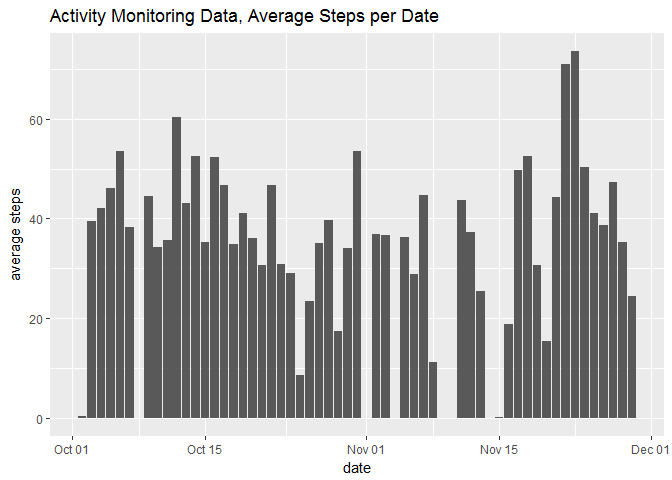
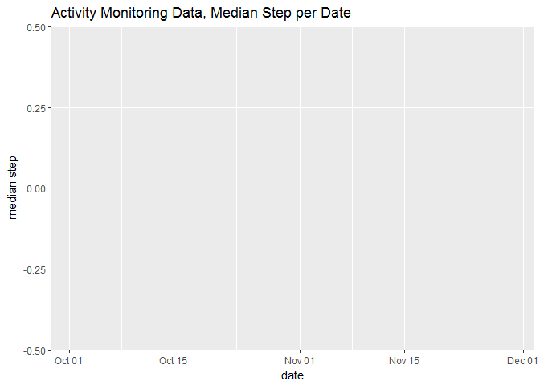
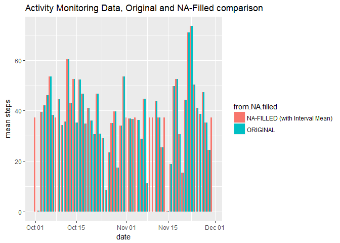
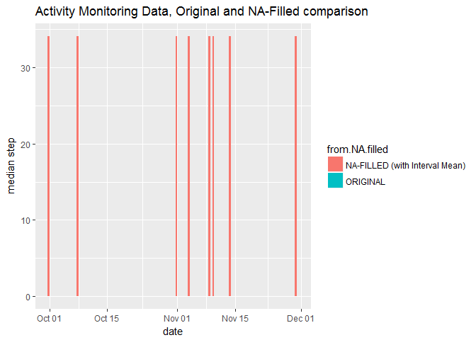

# Reproducible Research: Peer Assessment 1


## Loading and preprocessing the data

```r
InstallAndLoadRequiredPackages <- function() {
  # Load the required packages.
  if (!require('pacman')) {
    install.packages('pacman')
  }
  pacman::p_load(chron, data.table, dtplyr, tidyverse)
}

InstallAndLoadRequiredPackages()
```

```
## Loading required package: pacman
```

```r
activity.monitoring.data <- read_csv('activity.zip')
```

```
## Parsed with column specification:
## cols(
##   steps = col_integer(),
##   date = col_date(format = ""),
##   interval = col_integer()
## )
```

## What is the total number of steps taken per day?

```r
activity.monitoring.data.total.steps.per.day <-  activity.monitoring.data %>%
  group_by(date) %>%
  summarise(total.steps = sum(steps, na.rm = TRUE)) 

activity.monitoring.data.total.steps.per.day %>%
  ggplot(aes(date, total.steps)) + geom_col() +
  ggtitle('Activity Monitoring Data, Total Steps per Date') +
  ylab('total steps')
```

<!-- -->

## What is mean number of steps taken per day?

```r
activity.monitoring.data.mean.steps.per.day <- activity.monitoring.data %>%
  group_by(date) %>%
  summarise(mean.steps = mean(steps, na.rm = TRUE)) 

activity.monitoring.data.mean.steps.per.day %>%
  ggplot(aes(date, mean.steps)) + geom_col() +
  ggtitle('Activity Monitoring Data, Average Steps per Date') +
  ylab('average steps')
```

```
## Warning: Removed 8 rows containing missing values (position_stack).
```

<!-- -->

## What is median total number of steps taken per day?

```r
activity.monitoring.data.median.steps.per.day <- activity.monitoring.data %>%
  group_by(date) %>%
  summarise(median.steps = median(steps, na.rm = TRUE)) 

activity.monitoring.data.median.steps.per.day %>%
  ggplot(aes(date, median.steps)) + geom_col() +
  ggtitle('Activity Monitoring Data, Median Step per Date') +
  ylab('median step')
```

```
## Warning: Removed 8 rows containing missing values (position_stack).
```

<!-- -->


## What is the average daily activity pattern?

```r
average.steps.by.interval <- activity.monitoring.data %>%
  group_by(interval) %>%
  summarise(mean.steps = mean(steps, na.rm = TRUE))

average.steps.by.interval %>%
  ggplot(aes(interval, mean.steps)) +
  geom_line() +
  ggtitle('Activity Monitoring Data, Average Steps per 5-minute Interval') +
  xlab('5-minute interval') +
  ylab('average steps') +
  geom_point(data = subset(average.steps.by.interval, mean.steps == max(mean.steps))) +
  geom_text(aes(label = ifelse(mean.steps == max(mean.steps), paste('Interval with max steps: ', interval), '')), 
            hjust = 1, vjust = 0)
```

<!-- -->

## Inputting missing values

```r
print(paste('Total number of missing values in the dataset:', sum(is.na(activity.monitoring.data$steps))))
```

```
## [1] "Total number of missing values in the dataset: 2304"
```

```r
###

activity.monitoring.data.na.filled <- activity.monitoring.data %>%
  mutate(steps = ifelse(is.na(steps), average.steps.by.interval$mean.steps, steps))

###

activity.monitoring.data.na.filled.total.steps.per.day <-  activity.monitoring.data.na.filled %>%
  group_by(date) %>%
  summarise(total.steps = sum(steps))

activity.monitoring.data.na.filled.mean.steps.per.day <- activity.monitoring.data.na.filled %>%
  group_by(date) %>%
  summarise(mean.steps = mean(steps))

activity.monitoring.data.na.filled.median.steps.per.day <- activity.monitoring.data.na.filled %>%
  group_by(date) %>%
  summarise(median.steps = median(steps))

### 

bind_rows('ORIGINAL' = activity.monitoring.data.total.steps.per.day,
          'NA-FILLED (with Interval Mean)' = activity.monitoring.data.na.filled.total.steps.per.day,
          .id = 'from.NA.filled') %>%
  ggplot(aes(date, total.steps, fill = from.NA.filled)) +
  geom_col(position = "dodge") +
  ggtitle('Activity Monitoring Data, Original and NA-Filled comparison') +
  ylab('total steps')
```

<!-- -->

```r
bind_rows('ORIGINAL' = activity.monitoring.data.mean.steps.per.day,
          'NA-FILLED (with Interval Mean)' = activity.monitoring.data.na.filled.mean.steps.per.day,
          .id = 'from.NA.filled') %>%
  ggplot(aes(date, mean.steps, fill = from.NA.filled)) +
  geom_col(position = "dodge") +
  ggtitle('Activity Monitoring Data, Original and NA-Filled comparison') +
  ylab('mean steps')
```

```
## Warning: Removed 8 rows containing missing values (geom_col).
```

<!-- -->

```r
bind_rows('ORIGINAL' = activity.monitoring.data.median.steps.per.day,
          'NA-FILLED (with Interval Mean)' = activity.monitoring.data.na.filled.median.steps.per.day,
          .id = 'from.NA.filled') %>%
  ggplot(aes(date, median.steps, fill = from.NA.filled)) +
  geom_col(position = "dodge") +
  ggtitle('Activity Monitoring Data, Original and NA-Filled comparison') +
  ylab('median step')
```

```
## Warning: Removed 8 rows containing missing values (geom_col).
```

<!-- -->


## Are there differences in activity patterns between weekdays and weekends?

```r
activity.monitoring.data.na.filled %>%
  mutate(weekend = ifelse(is.weekend(date), TRUE, FALSE)) %>%
  group_by(interval, weekend) %>%
  summarise(mean.steps = mean(steps)) %>%
  ggplot(aes(interval, mean.steps, color = weekend)) + 
  geom_line() +
  ggtitle('Activity Monitoring Data, Average Steps per 5-minute Interval') +
  xlab('5-minute interval') +
  ylab('average steps')
```

<!-- -->
